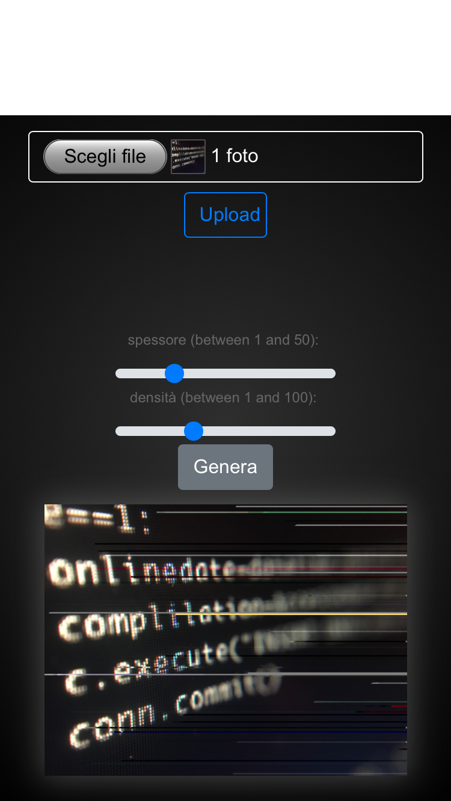

# ModHex
 
<b>ModHex.py</b> 
it is the main algorithm to modify the bits of photos (jpg), videos (mp4, mov, avi, etc ...), the less the file is compressed the more can be the number of changes and the better the result.

You can use the site to automate the process

